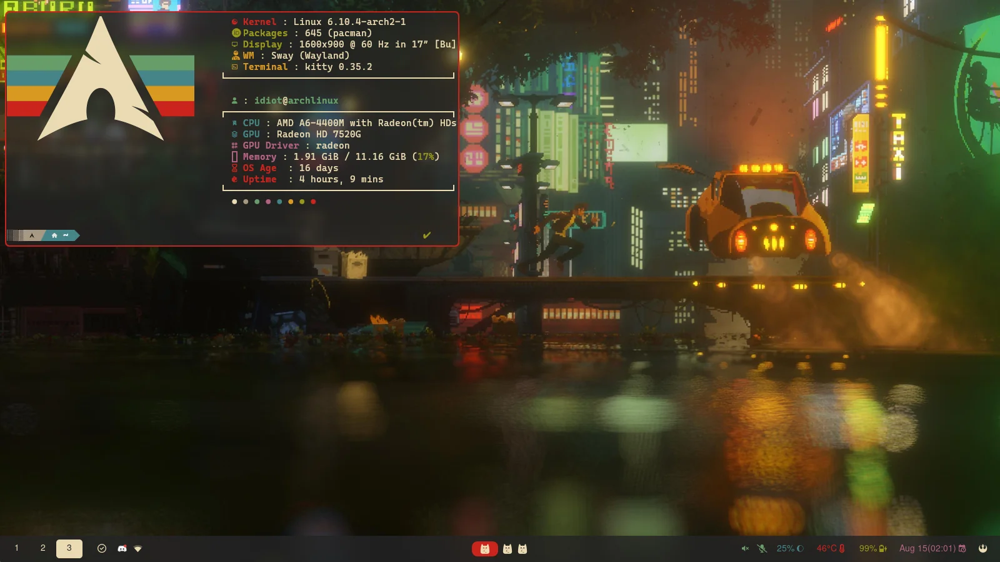
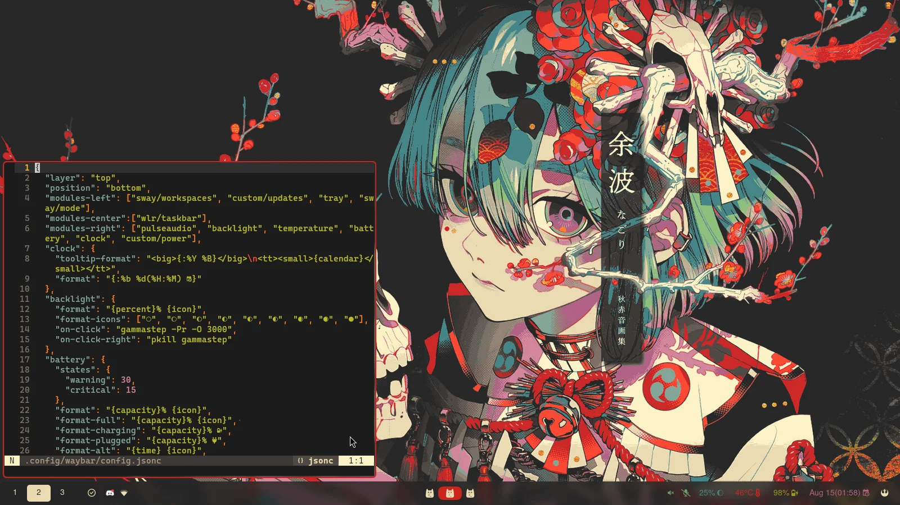
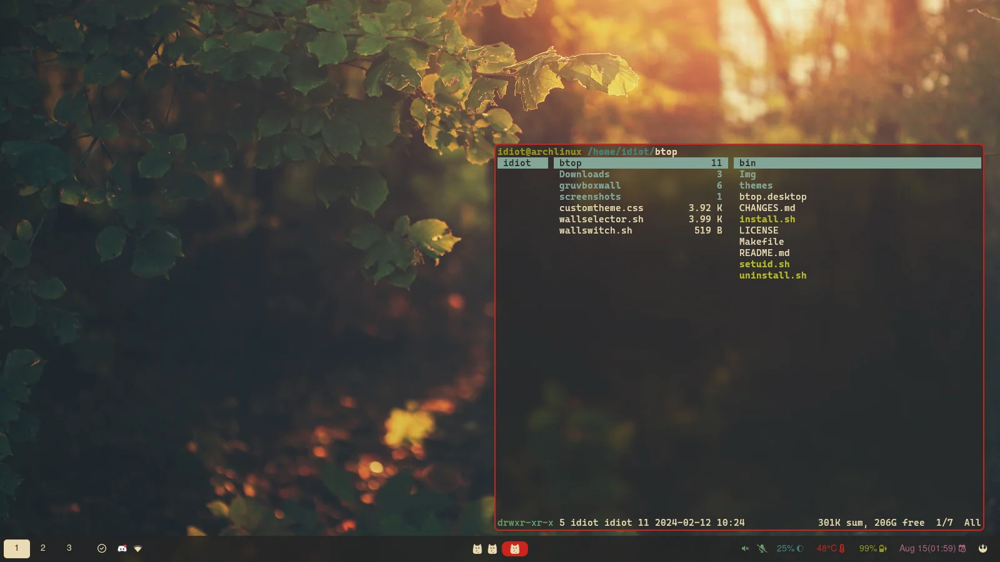
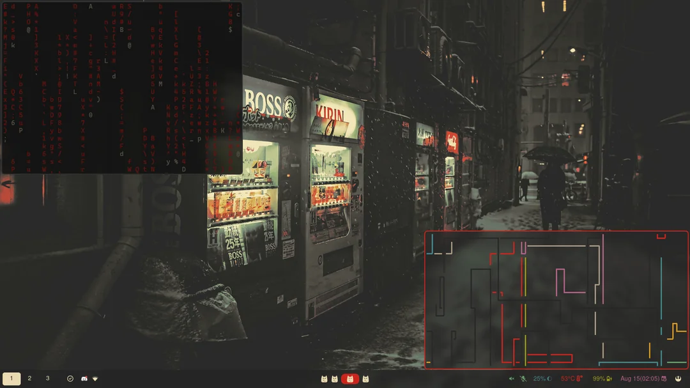

<div align="center">

<p>My customized SwayFX-Gruvbox themed dotfile configurations & scripts</p>
<a href='#'></a>
<a href='#'></img></a>
</div>

---

### 🖥️ ScreenShot




<details>
<summary><b>Load More</b> <span style="font-size:14px;">(Click to expend) </span> </summary>






</details>

## Installation(with script)
To install, execute the following commands:

```shell
pacman -S git
git clone https://github.com/Licensed-Idiot/Swaydots.git ~/Swaydots
cd ~/Swaydots/Install
./install.sh
```
As a second install option, you can also use [Manual Installation](#-manual-installation), which might be easier for some.

Please reboot after the install script completes.

If the theming of kvantum and gtk doesn't automatically apply, refer [here](#set-the-themes)

### 🗒️ Info

|Program|Name|
| - | :--: |
|**Window Manager**|[Sway](https://github.com/WillPower3309/swayfx)|
|**Terminal Emulator**|[Kitty](https://github.com/kovidgoyal/kitty)|
|**Bar**|[waybar](https://github.com/Alexays/Waybar)|
|**Application Launcher**|[Rofi-wayland](https://github.com/lbonn/rofi)|
|**Notification Daemon**|[Dunst](https://github.com/dunst-project/dunst)|
|**Display Manager**|None|
|**network management tool**|[NetworkManager](https://networkmanager.dev/)|
|**System resource monitor**|[Btop](https://github.com/aristocratos/btop)|
|**File Manager**|[Ranger](https://github.com/ranger/ranger)|
|**Lockscreen**|[Swaylock-effects](https://github.com/mortie/swaylock-effects)|
|**Shell**|[Zsh](https://www.zsh.org/)|
|**Shell Framework**|[Oh-My-Zsh](https://github.com/ohmyzsh/ohmyzsh), [Powelevel10k](https://github.com/romkatv/powerlevel10k)|
|**Music Player**|[Spotify](https://github.com/kpcyrd/spotify-launcher), [Spicetify](https://spicetify.app/)|
|**Media Player**|[Celluloid](https://celluloid-player.github.io/)|
|**Text Editor**|[Neovim](https://github.com/neovim/neovim)|
|**GTK Theme**|[Gruvbox Material](https://github.com/Fausto-Korpsvart/Gruvbox-GTK-Theme)|
|**Icons**|[Gruvbox Plus](https://github.com/SylEleuth/gruvbox-plus-icon-pack)|
|**Fonts**|[Nerd fonts](https://github.com/ryanoasis/nerd-fonts)|
|**Image Viewer**|[imv](https://sr.ht/~exec64/imv/)|
|**Screenshot Software**|[grimshot](https://github.com/swaywm/sway/blob/master/contrib/grimshot)|
|**Clipboard**|[wl-clipboard](https://github.com/bugaevc/wl-clipboard), [cliphist](https://github.com/sentriz/cliphist)|

### 🔨 Dependencies
#### Packages
  - swayfx
  - waybar
  - btop
  - swww
  - rofi
  - swaylock-effects
  - dunst
  - pipewire & pipewire-pulse
  - brightnessctl & gammastep
  - kitty
  - nwg-look
  - spotify-launcher
  - celluloid
  - nm-applet
  - grimshot
  - wl-clipboard/cliphist
  - imv
#### Fonts
  - font-awesome
  - cascadia-code-nerd


# 🚀 Manual Installation
1. **Clone this repository**
```bash
git clone https://github.com/Licensed-Idiot/Swaydots.git ~/Swaydots
```

2.**Install the required software**

cd into the cloned dotfiles folder
```bash
cd ~/path/to/dotfiles/Configs
```
and install the packages found in `packages.lst`.
You're going to need an aur helper, a guide can be found [here](https://itsfoss.com/install-yay-arch-linux/). Then enter the command
```bash
yay -S --needed $(awk '{print $1}'  packages.lst)
```
and it should download the latest version of each package. (you can use paru if you want, it's just a package list).
Also install Btop from [here](https://github.com/aristocratos/btop?tab=readme-ov-file#installation), and follow it's installation guide

3. **Install Oh-my-zsh on powerlevel10k**

Now that the zsh is installed lets make it our default terminal and make it look nice.
To install Oh-my-zsh use this command
```bash
sh -c "$(curl -fsSL https://raw.github.com/robbyrussell/oh-my-zsh/master/tools/install.sh)"
```
Then install Powerlevel10k
```bash
git clone https://github.com/romkatv/powerlevel10k.git $ZSH_CUSTOM/themes/powerlevel10k
```
I then have these plugins, zsh-syntax-highlighting and zsh-autosuggestions
```bash
git clone https://github.com/zsh-users/zsh-syntax-highlighting.git ${ZSH_CUSTOM:-~/.oh-my-zsh/custom}/plugins/zsh-syntax-highlighting

git clone https://github.com/zsh-users/zsh-autosuggestions ${ZSH_CUSTOM:-~/.oh-my-zsh/custom}/plugins/zsh-autosuggestions
```
after installing copy my zshrc config and p10k config
```bash
cp .p10k.zsh ~/
cp .zshrc ~/
```
[guide used](https://dev.to/abdfnx/oh-my-zsh-powerlevel10k-cool-terminal-1no0)

4. **Copy the configurations**

Now for the rest of the configurations, copy the `.config` and `.local` folders from the `Configs` folder into your home directory.
```bash
cp -r .config ~/
cp -r .local ~/
```
Afterwards, reboot your system, login, and start sway
```bash
reboot
```
to start sway after login just type `sway` into your terminal and you should see a mouse cursor and a backround(You can change the backround using [Wallpaper Select](#-keybinds)). 
Horray! that means my install steps were correct and I didnt mess it up lol.

## Set the themes

Finally, we just have to set our default themes for nwg.

For nwg/gtk, we need to download [Gruvbox Material](https://github.com/Fausto-Korpsvart/Gruvbox-GTK-Theme), just follow their install steps to get the theme you want (I followed their CLI installation steps). 
Now to use that theme, type `nwg-look` into your terminal or run the app menu with `Win(Super) + D` and find it there (should be called "GTK Settings").
 Once in the app, select the gtk theme, and the icon theme (icons were installed with the package list, if it doesn't show, you can find out how to install it [here](https://github.com/SylEleuth/gruvbox-plus-icon-pack)). You just click one the ones with the name gruvbox in them, then hit apply in the bottom right corner. To see the changes, restart sway `Super + Shift + C`

That should be it! I hope you enjoy the configuration, I'll try to figure out a script for the future, and if you have any problems open an issue, I'll get to you as soon as I can.

### 🔑 Keybinds 
These are some of the custom & basic keybinds. For more keybinds check [here](https://depau.github.io/sway-cheatsheet/), can also check the keybinds in `~/.config/sway/config.d/keybinds.conf`.
|        Keybind         |                 Function                 |
| ---------------------- | ---------------------------------------- |
| `Win(Super) + Enter`   | Launch terminal (kitty)                  |
| `Super + Shift + Q`    | Kill focused window                      |
| `Super + P`            | Take Screenshot                          |
| `Super + Shift + P`    | Take a snippet Screenshot                |
| `Super + D`            | Launch Rofi                               |
| `Alt + Enter`          | Launch Rofi Window Manager                |
| `Super + Shift + E`    | Show wlogout Menu                        |
| `Super + Shift + C`    | Restart sway                             |
| `Super + Shift + W`    | Wallpaper select                         |
